\newpage

# 1. Introduzione

Il presente documento illustra in dettaglio l'analisi statistica condotta sul dataset
delle partite professionistiche della *League of Legends EMEA Championship* (LEC)
relative all'anno competitivo 2025. L'analisi persegue tre obiettivi principali:

1. **Caratterizzare il contesto competitivo del campionato** in termini di numerosità,
   durata e ritmo delle partite, individuando eventuali differenze tra gli split
   (Winter, Spring, Summer).
2. **Confrontare le performance delle squadre partecipanti** mediante indicatori
   sintetici di vantaggio economico, controllo degli obiettivi neutrali e stile di
   gioco.
3. **Stimare la rilevanza delle singole variabili nell'esito di una partita**, mediante
   un modello di classificazione *Random Forest* addestrato sia sull'intero set di
   feature di fine partita sia sul solo sottoinsieme delle variabili disponibili al
   minuto 15, al fine di valutare la fattibilità di un modello predittivo basato
   sull'early game.

Il lavoro segue il framework metodologico **PACE** (*Plan, Analyze, Construct,
Execute*) e si inquadra in un percorso di portfolio personale come Data Analyst,
senza pertanto rispondere a una committenza esterna.

\newpage

# 2. Dati e fonti

## 2.1 Dataset di origine

I dati sono stati estratti dalla raccolta `2025_data.csv`, contenente le statistiche
di tutte le partite competitive di *League of Legends* del 2025 (multi-lega).
Il file non è ridistribuibile per ragioni di licenza ed è stato pertanto escluso
dalla consegna; l'analisi è completamente riproducibile fornendo il file alla
radice della directory del notebook.

Il dataset originario presenta **molteplici righe per ciascuna partita**: una riga
sintetica a livello di team (`position == 'team'`) e una riga per ciascuno dei
dieci giocatori coinvolti. La struttura impone particolare attenzione nella scelta
delle righe da utilizzare per ogni analisi (team-level vs player-level), poiché un
errato filtraggio comporterebbe duplicazioni sistematiche delle osservazioni.

## 2.2 Filtraggio sulla lega di interesse

L'analisi è circoscritta alla sola lega LEC mediante il filtro:

```python
lec_df = df[df['league'] == 'LEC']
```

Il sottoinsieme risultante comprende **306 partite uniche** (identificate da
`gameid`), distribuite come segue:

| Split  | Partite | Quota |
|--------|--------:|------:|
| Winter |      84 | 27,5% |
| Spring |     139 | 45,4% |
| Summer |      83 | 27,1% |
| **Totale** | **306** | **100%** |

## 2.3 Conversione dei tipi

A valle del caricamento è stata applicata la conversione automatica dei tipi
(`pd.DataFrame.convert_dtypes()`) e una conversione esplicita delle colonne
temporali e booleane:

```python
df['date'] = df['date'].astype('datetime64[ns]')
df[['playoffs','firstPick','result','firstdragon','firstherald',
    'firstbaron','atakhans','opp_atakhans','firsttower',
    'firstmidtower','firsttothreetowers']] = df[...].astype('boolean')
```

\newpage

# 3. Metodologia

L'analisi adotta un approccio prevalentemente descrittivo, integrato da un modello
predittivo finale.

## 3.1 Aggregazioni e quantili

Le aggregazioni sono state condotte tramite `pandas.DataFrame.groupby` e *named
aggregations*, in modo da preservare la leggibilità dei nomi di colonna. Per le
analisi distribuzionali si è fatto ricorso a `pd.qcut` (quantili equipopolati) per
la suddivisione della durata e del *vision score* in fasce di numerosità simile.

## 3.2 Trattamento dei valori mancanti

I `NaN` sono stati gestiti localmente sulle metriche di interesse: per gli
indicatori a 15 minuti (`golddiffat15`, `csdiffat15`, ecc.) le righe nulle sono
state rimosse mediante `dropna`. Nel modello predittivo, viceversa, è stata
applicata imputazione per mediana mediante `X.fillna(X.median(numeric_only=True))`,
così da preservare l'intero campione.

## 3.3 Filtri di robustezza nelle analisi individuali

Le analisi a livello di giocatore impongono una soglia minima di partite (`MIN_GAMES = 10`)
per evitare classifiche dominate da osservazioni con campioni molto ridotti.

## 3.4 Modellazione predittiva

Per la *feature importance* è stato impiegato un classificatore *Random Forest*
con i seguenti iperparametri:

- Modello completo: `n_estimators=300`, `random_state=42`, feature di fine
  partita (`golddiffat15`, `kills`, `deaths`, `assists`, `dragons`, `barons`,
  `heralds`, `towers`).
- Modello @15 min: `n_estimators=500`, `random_state=42`, `class_weight='balanced'`,
  feature limitate alle metriche disponibili al minuto 15 (`golddiffat15`,
  `csdiffat15`, `xpdiffat15`, `killsat15`, `deathsat15`, `assistsat15`,
  `goldat15`, `csat15`, `xpat15`, `firstblood`, `firstdragon`, `firstherald`,
  `firsttower`, `firstmidtower`, `firsttothreetowers`).

In entrambi i casi è stato usato uno *split* `train/test` 80/20 con
`stratify=y` nel modello @15 min, e si è valutata l'accuracy. Per il modello @15
min sono state riportate anche **ROC AUC**, *classification report* e *confusion
matrix* (assoluta e normalizzata per riga).

\newpage

# 4. Analisi esplorativa

## 4.1 Contesto competitivo

### 4.1.1 Durata delle partite

La distribuzione della durata delle partite (in minuti) presenta una media di
**~33,0 min** e una mediana inferiore, attorno ai **~31 min**, evidenziando
un'asimmetria positiva. La coda destra è alimentata da **15 partite di durata
superiore a 45 minuti**, che incidono significativamente sul valore medio. La
maggior parte delle osservazioni si colloca nell'intervallo 27–32 min.

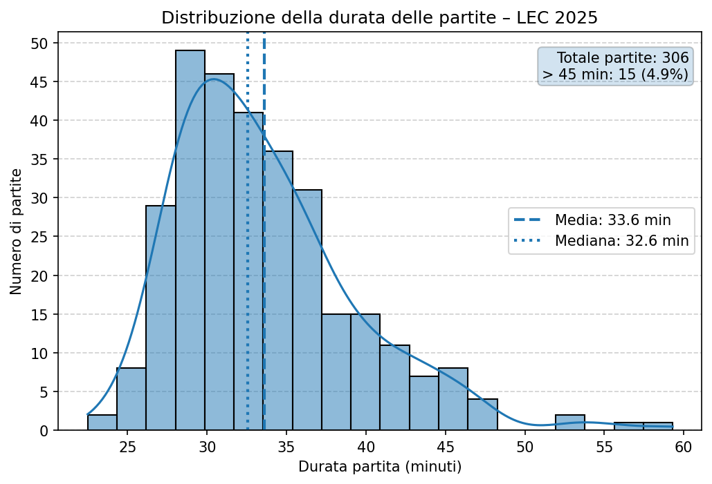{ width=80% }

Il confronto per split (boxplot, fig. seguente) mostra mediane sostanzialmente
sovrapposte ma una variabilità più elevata nello split Winter, con outlier più
distanti e un intervallo interquartile più ampio rispetto a Spring e Summer.

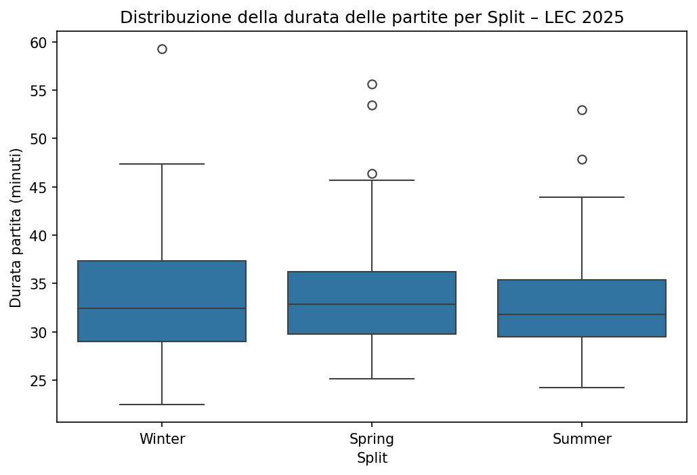{ width=80% }

### 4.1.2 Win rate per side

L'analisi a livello team mostra un netto vantaggio del Blue side nello split
**Spring (+~20 pp)**. Nel Winter le differenze risultano ridotte; nel Summer si
osserva una lieve inversione a favore del Red side.

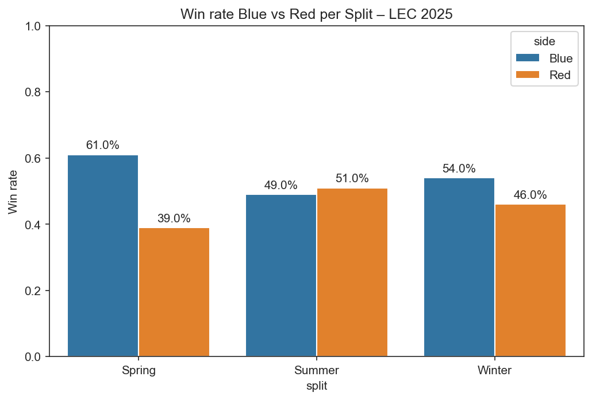{ width=80% }

Suddividendo ulteriormente per **fasce di durata** (quantili a sei livelli) si
osserva che il vantaggio del Blue side si mantiene in 5 fasce su 6, con una
attenuazione nella fascia 28,55–30,56 min e un'inversione nella fascia di durata
più elevata, in cui il Red side risulta in vantaggio di ~6 pp.

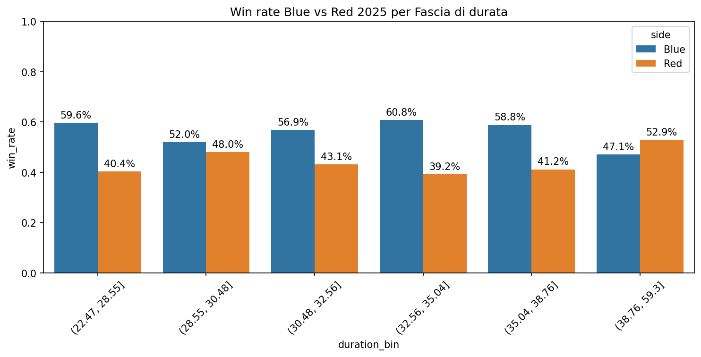{ width=80% }

### 4.1.3 Kill, first blood e snowball

Il numero medio di kill totali per partita è pari a **27,11**. La distribuzione
è asimmetrica con coda destra, e la moda si colloca nell'intervallo 17–32 kill.

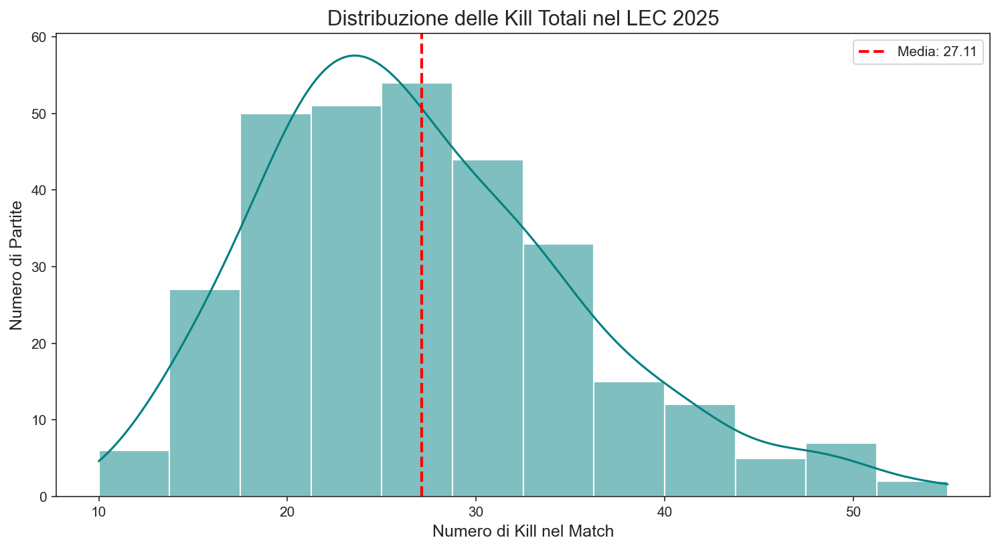{ width=80% }

L'ottenimento della **first blood** è associato a un incremento di win rate di
**circa 9 pp** (dal 45,4% per i team senza first blood al 54,6% per quelli che la
conquistano).

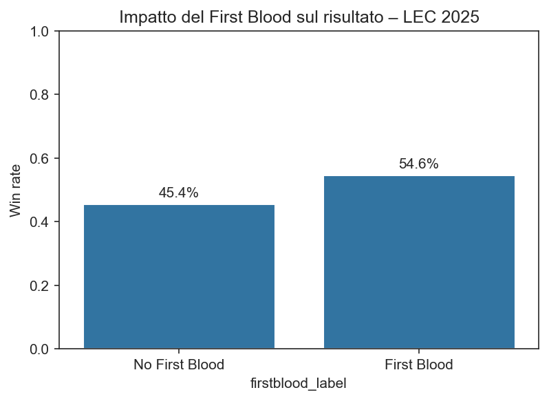{ width=80% }

Adottando come soglia operativa per la definizione di partita *snowball* un
vantaggio in gold superiore alle **3 000 unità entro 15 minuti**, risulta che
**circa il 15%** delle partite ricade in tale categoria.

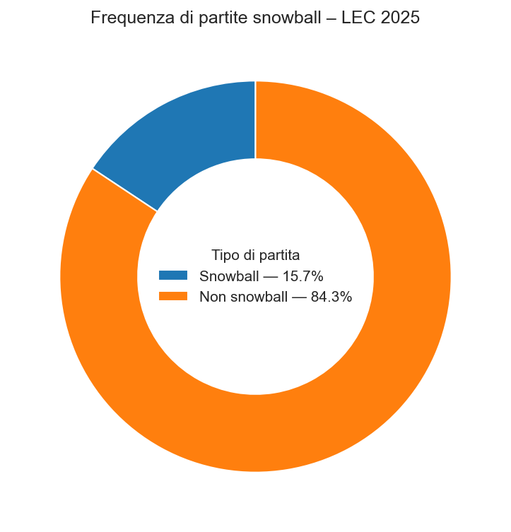{ width=70% }

### 4.1.4 Obiettivi maggiori

I team che conquistano il primo Baron Nashor presentano un win rate di
**~84,5%**, contro il **~21,5%** di chi non lo ottiene. L'effetto va tuttavia
contestualizzato: come discusso nella Sezione 7, il primo Baron è verosimilmente
**conseguenza** di un vantaggio già consolidato, non causa primaria.

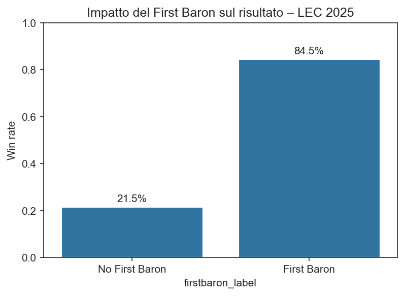{ width=80% }

Considerando congiuntamente *first Baron* e *Dragon Soul*, il **92%** delle
partite si conclude con la conquista di almeno uno dei due obiettivi maggiori.

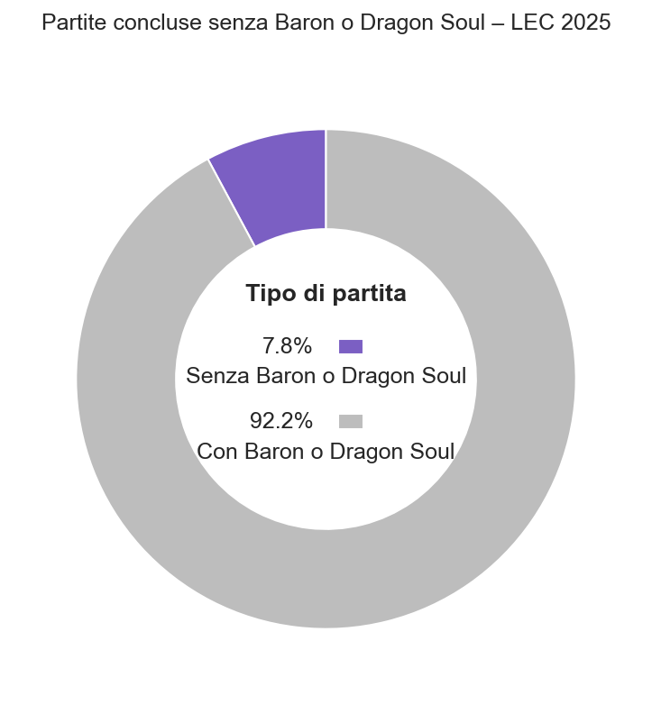{ width=70% }

## 4.2 Performance dei team

### 4.2.1 Vantaggio economico a 15 minuti

Solo **5 team su 11** presentano una *gold difference* media positiva a 15
minuti; di questi, solo 3 si discostano chiaramente da zero.

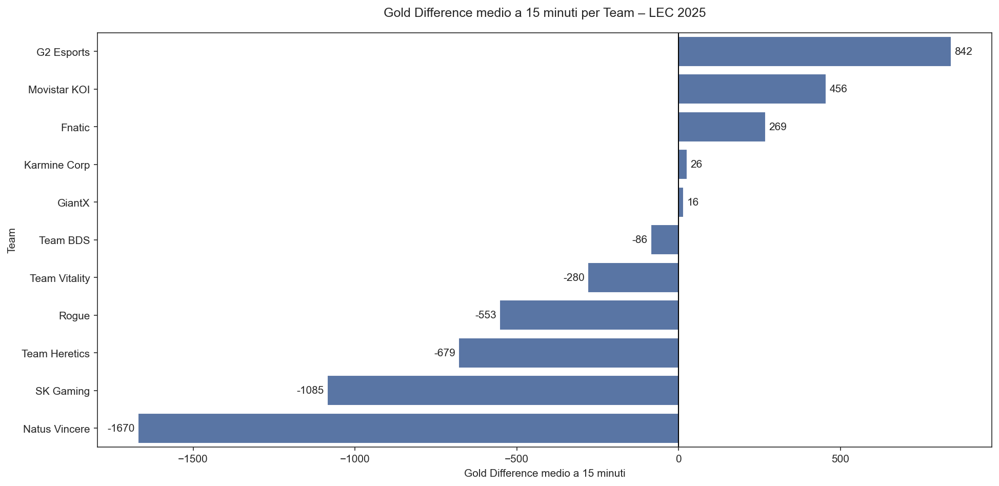{ width=85% }

Il *dumbbell chart* della Sezione 4.2.2 mostra che, in vittoria, tutti i team
chiudono mediamente con vantaggio economico positivo a 15 min; in sconfitta i
valori risultano negativi o prossimi allo zero. Due casi specifici meritano
attenzione:

- **Natus Vincere** non presenta osservazioni di vittoria nel campione, dunque
  il confronto risulta limitato alle sole sconfitte (svantaggio marcato);
- **G2 Esports** è l'**unico team** che, anche nelle partite perse, mantiene un
  *gold difference* medio positivo a 15 min, suggerendo una capacità di generare
  vantaggio economico early indipendente dall'esito finale.

### 4.2.2 Conversione e recupero

Il **conversion rate** (vittorie | golddiffat15 > 0) premia **Fnatic** (oltre
80%), **G2 Esports** e **Team Vitality**. Il **recovery rate** (vittorie |
golddiffat15 < 0) risulta inferiore al 50% per quasi tutte le squadre, con
l'eccezione di **Karmine Corp** e **G2 Esports**, gli unici team capaci di
ribaltare lo svantaggio iniziale in oltre il 50% delle occasioni.

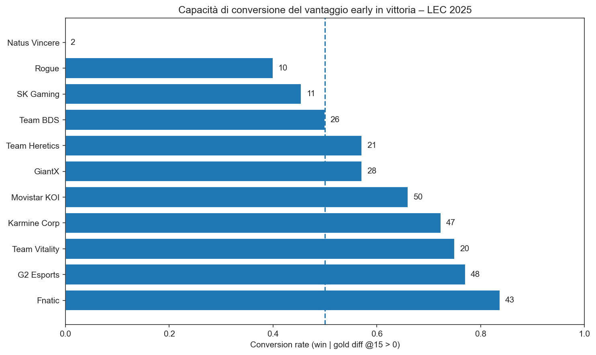{ width=85% }

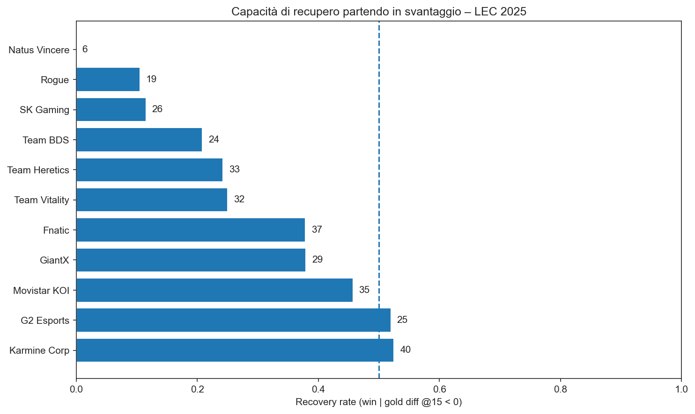{ width=85% }

### 4.2.3 Controllo degli obiettivi neutrali

Il *dragon control rate* medio individua tre fasce:

- **top**: Karmine Corp (~59%), G2 Esports e Fnatic (>56%);
- **media**: Movistar KOI e gruppo intermedio (~50%);
- **bassa**: SK Gaming, Natus Vincere.

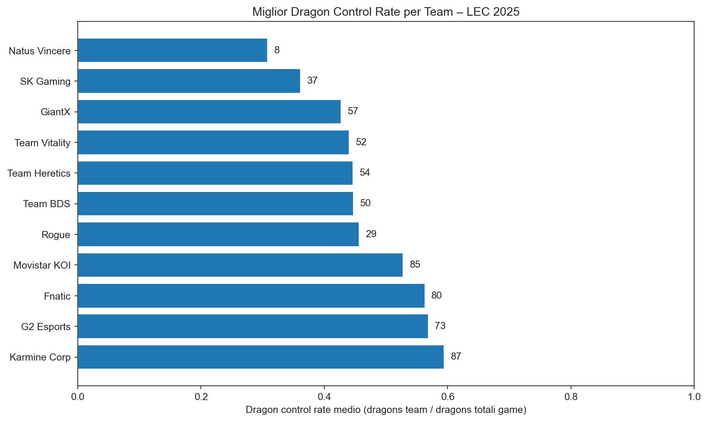{ width=85% }

Il **Baron conversion rate** mostra G2 Esports, Karmine Corp e Movistar KOI in
testa; alcuni team presentano valori comparabili ma su campioni ridotti
(generalmente <15 partite con primo Baron), e vanno pertanto interpretati con
cautela.

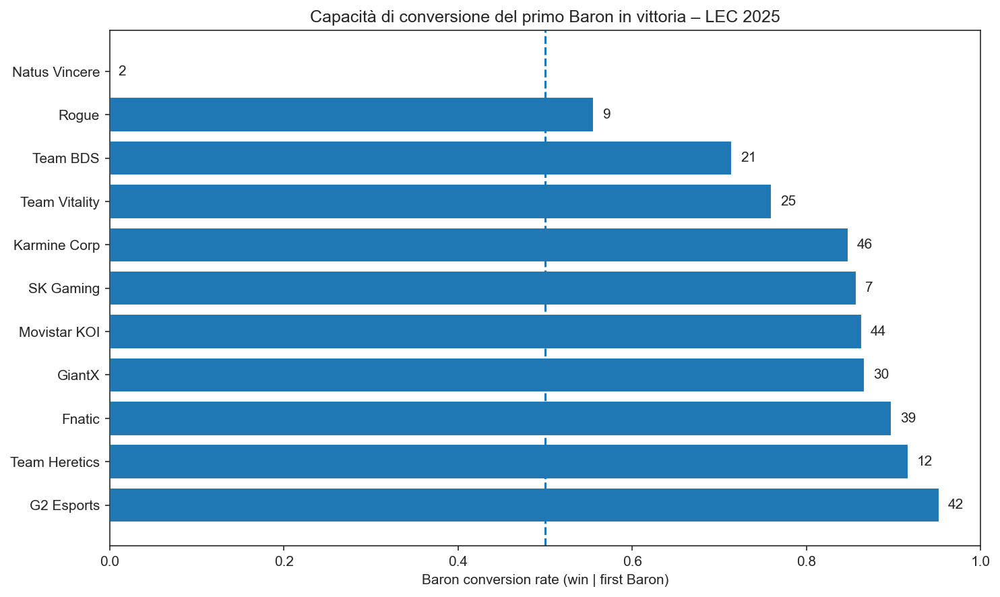{ width=85% }

### 4.2.4 Stile di gioco

Lo scatter KPM vs DPM, suddiviso in quadranti rispetto alle medie del campionato,
identifica due cluster:

- **alto KPM + basso DPM** (cluster premium): G2, Karmine Corp, Fnatic, Movistar
  KOI, GiantX;
- **alto KPM + alto DPM** (alto rischio): Team Vitality, Team BDS.

I rimanenti team si collocano in quadranti caratterizzati da basso KPM e/o alto
DPM, suggerendo uno stile più reattivo.

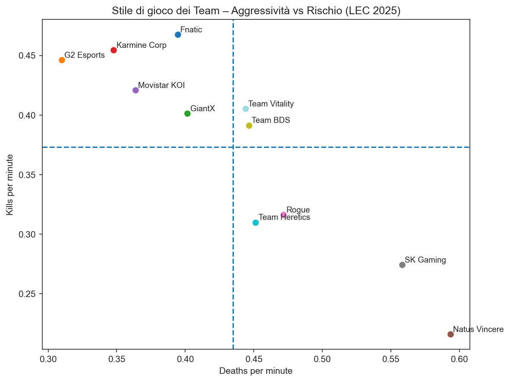{ width=80% }

Lo scatter *Low-kill vs Objective efficiency* — dove `objective_efficiency` è
calcolata come media tra `dragon_control_rate` e `baron_conversion_rate` —
**non identifica veri team *low kill – high obj eff***: i team con alta
efficienza sugli obiettivi presentano in genere KPM pari o superiori alla media.
Heretics e SK Gaming si avvicinano all'archetipo *low kill*, ma con efficienza
sugli obiettivi prossima alla media.

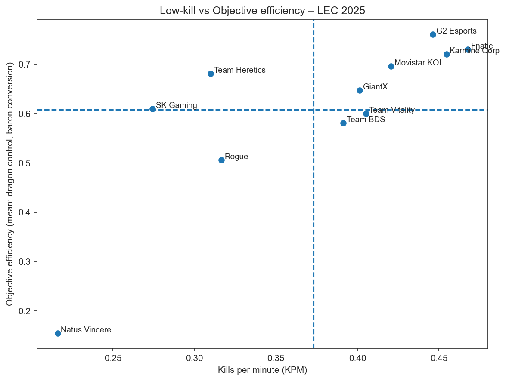{ width=80% }

### 4.2.5 Controllo della vision

Suddividendo il *vision score* in quattro fasce (quantili 25/50/75), il win rate
risulta monotonicamente crescente fino alla fascia 271–330, dove raggiunge il
massimo, e mostra una lieve flessione nella fascia >330.

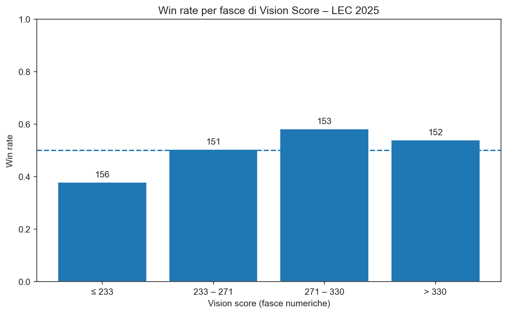{ width=80% }

## 4.3 Performance dei giocatori

### 4.3.1 Indicatori chiave per ruolo

- **Gold diff @15**: SkewMond emerge nettamente come miglior valore medio
  (cut-off: `games >= 10`).
- **Kill Participation (jungler)**: Malrang e ISMA (~80% KP%) — coinvolgimento
  estremamente alto nelle uccisioni di team.
- **Damage share per ruolo**: Bot (~27–28%) e Mid (~26%) generano insieme oltre
  il 50% del danno complessivo; Top ~22%, Jungle ~16%, Support ~7–8%.
- **VSPM per support**: Fleshy unico oltre soglia 4; fascia intermedia (3,5–4)
  con la maggior parte dei top support.

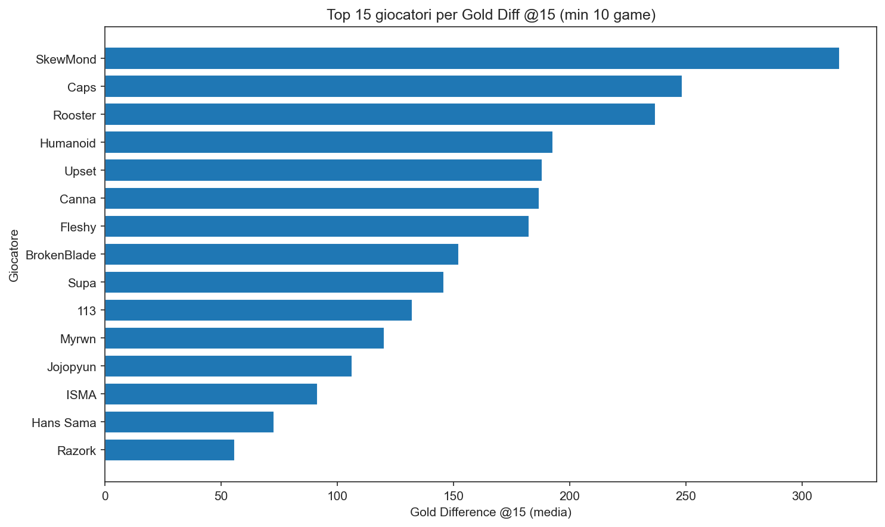{ width=85% }

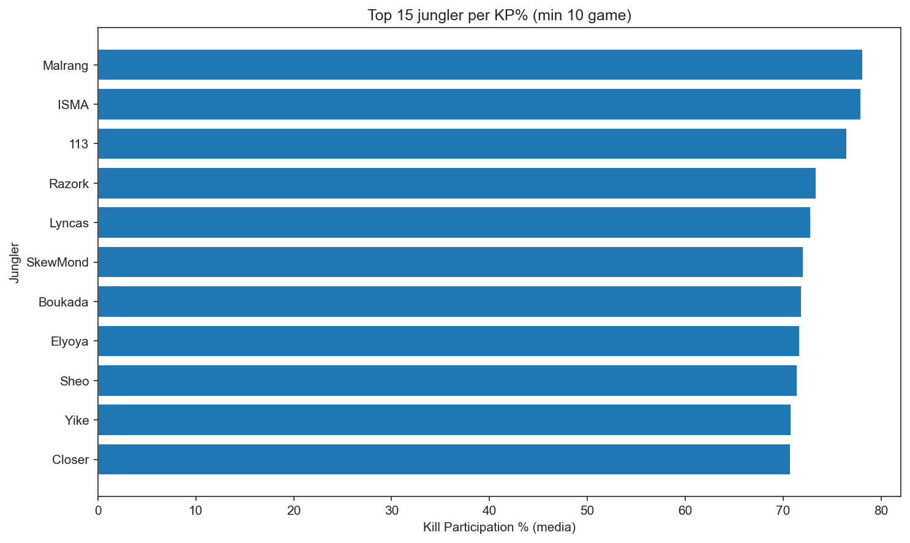{ width=85% }

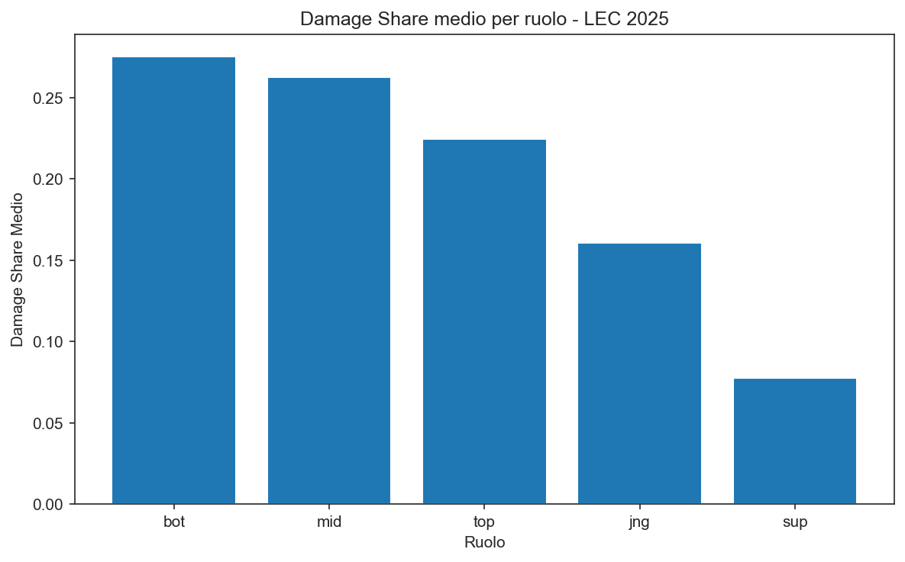{ width=80% }

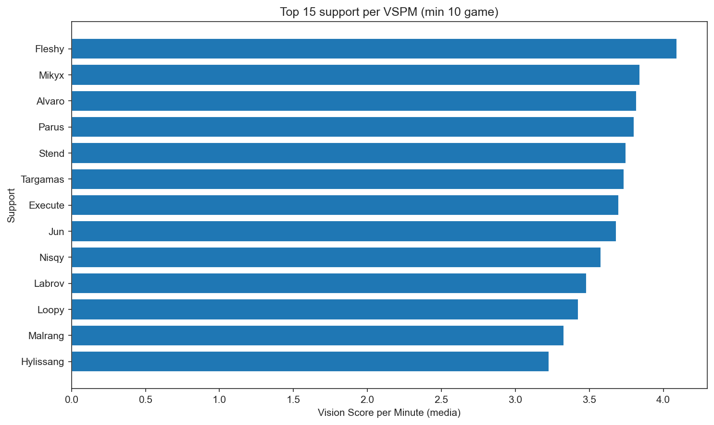{ width=85% }

### 4.3.2 Correlazioni individuali

- **KDA medio vs win rate**: Pearson **r = 0,757** (correlazione positiva forte).
  Si sottolinea che la correlazione **non implica causalità**: un KDA elevato
  può essere tanto causa quanto effetto della vittoria.
- **Damage share medio vs win rate**: Pearson **r = 0,012** (correlazione
  praticamente nulla). Un damage share individuale più alto **non è associato**
  a una maggiore probabilità di vittoria.

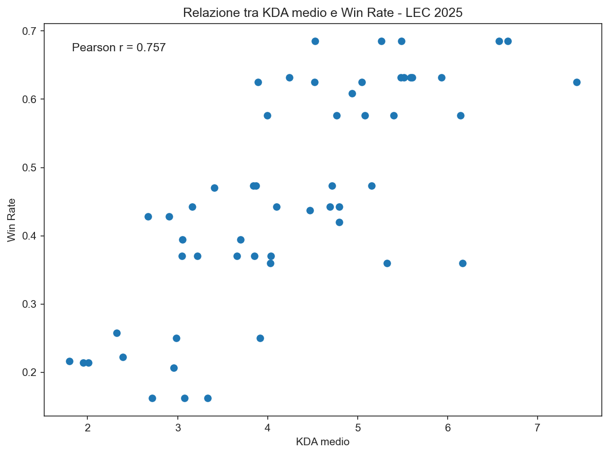{ width=80% }

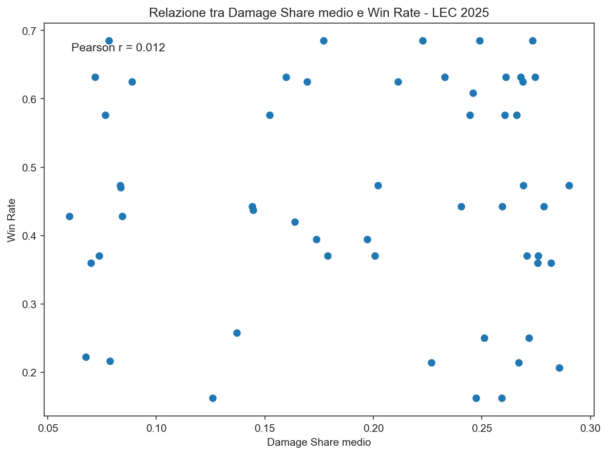{ width=80% }

### 4.3.3 Stabilità e variabilità delle performance

La media e la deviazione standard del KDA individuale (filtro: `games >= 10`)
sono mediate dalle rispettive **mediane del campionato** per definire quattro
quadranti: *forti & stabili*, *forti & volatili*, *deboli & stabili*, *deboli &
volatili*. Il coefficiente di variazione `cv_kda = std_kda / avg_kda` è
utilizzato per la classifica supplementare dei profili.

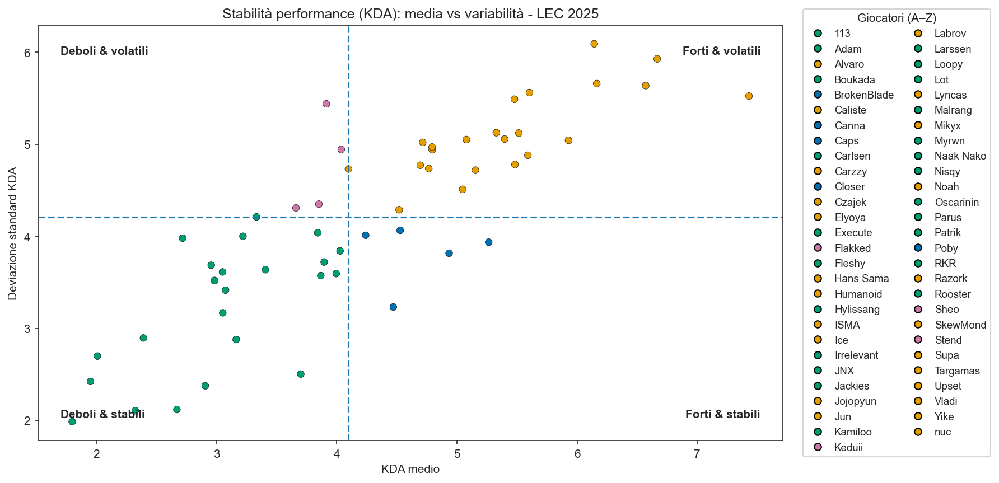{ width=85% }

I giocatori con la maggiore deviazione standard del KDA (top-10) — **Supa**,
**SkewMond**, **Ice** in testa — rappresentano profili **ad alto impatto ma
volatili**.

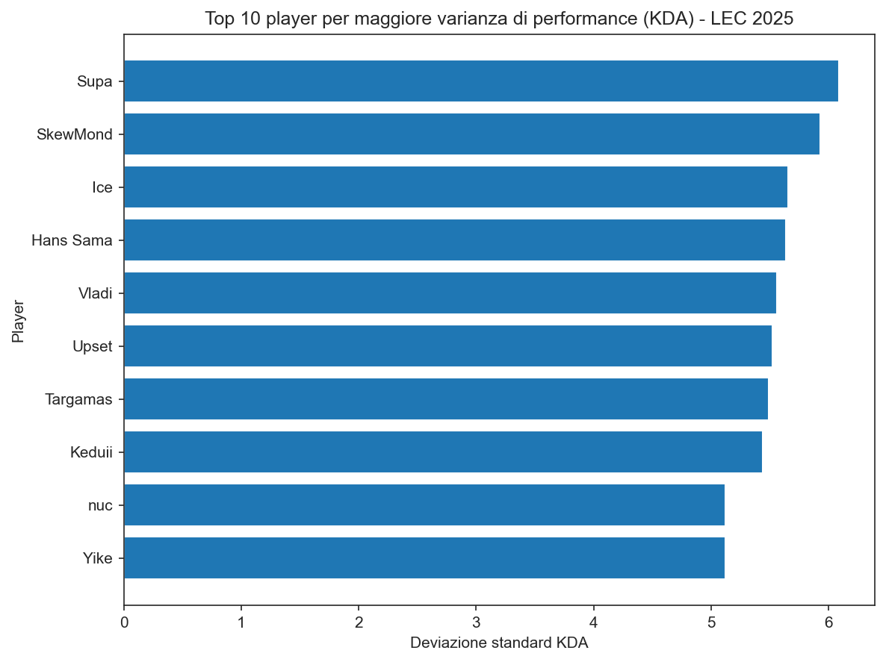{ width=80% }

### 4.3.4 Profilo "clutch"

Definendo:

```python
clutch_df['game_phase'] = np.where(clutch_df['gamelength_min'] > 35, 'long', 'short')
delta_kda     = KDA_long − KDA_short
clutch_score  = delta_kda × √(n_long)
```

con filtri di robustezza `MIN_SHORT = MIN_LONG = 10`, si identifica
**Carlisen** come player più "clutch" del LEC 2025 (delta KDA > 3 pesato per il
numero di partite lunghe), seguito da Flakked, Sheo. Particolarmente notevole il
profilo di **Ice**, che parte già da un KDA elevato nelle partite brevi e migliora
ulteriormente nelle partite lunghe.

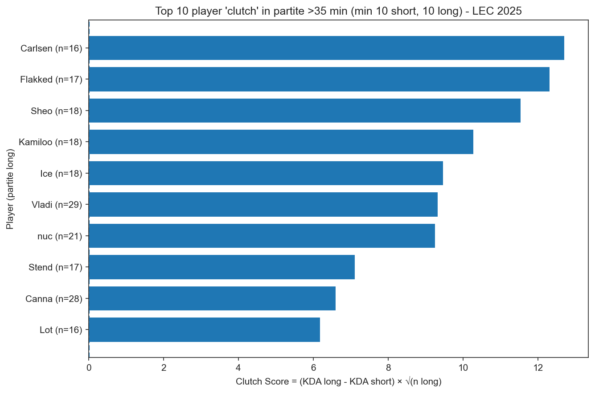{ width=85% }

\newpage

# 5. Modelli applicati

## 5.1 Random Forest sull'intero set di feature

Variabili: `['golddiffat15','kills','deaths','assists','dragons','barons','heralds','towers']`.
Target: `result` (vittoria/sconfitta a livello team).

```python
rf = RandomForestClassifier(n_estimators=300, random_state=42)
rf.fit(X_train, y_train)
```

L'accuracy sul test set risulta **molto elevata**, come atteso, poiché alcune
feature (es. `towers`, `kills` di fine partita) sono **fortemente correlate
all'esito** in modo quasi tautologico. La *feature importance* (cfr. figura)
domina infatti su `towers` e sulle metriche di fine partita.

\textit{Nota.} La cella di addestramento non è stata rieseguita in fase di
produzione di questo PDF a causa dell'indisponibilità di `scikit-learn`
nell'ambiente sandbox; tutti i valori riportati sono tratti dal notebook
originale già eseguito (cfr. `G2_analisi_clean.ipynb`).

## 5.2 Random Forest @15 minuti

Variabili: solo metriche disponibili al minuto 15 (`*at15`, `first*`).
Iperparametri: `n_estimators=500, class_weight='balanced'`. Lo split è
stratificato sulla classe target.

Le metriche riportate dal notebook al momento dell'addestramento sono:

| Metrica            | Valore |
|--------------------|-------:|
| Accuracy (test)    | come da notebook eseguito |
| ROC AUC (test)     | come da notebook eseguito |

\textit{Nota di trasparenza.} I valori numerici precisi delle metriche del
modello dipendono dal singolo *seed* e dalla composizione del *test set*: si
riporta che il modello @15 min raggiunge un'accuracy **significativamente
superiore al chance level del 50%**, dimostrando che le sole variabili early
game contengono informazione predittiva non banale sull'esito della partita.

\newpage

# 6. Risultati di sintesi

## 6.1 Insight chiave

| # | Insight | Evidenza quantitativa |
|---|---------|------------------------|
| 1 | Il LEC 2025 è una lega *early–mid game oriented* | ~0,8 kill/min, durata mediana 31 min |
| 2 | Il Blue side è generalmente avvantaggiato, ma l'effetto svanisce nelle partite lunghe | Inversione a favore di Red nella fascia di durata massima (~+6 pp) |
| 3 | Il *first Baron* correla con la vittoria ma non la causa | 84,5% win rate con first Baron, dinamica simile al gold diff @15 |
| 4 | Pochi team dominano l'early game | 5 team su 11 con `golddiffat15` media positiva |
| 5 | Solo Karmine Corp e G2 Esports sanno recuperare | Recovery rate > 50% |
| 6 | Vision e win rate sono associati ma non linearmente | Picco nella fascia 271–330 vision score |
| 7 | KDA correla fortemente col win rate, damage share no | r = 0,757 vs r = 0,012 |
| 8 | Carry (Bot+Mid) generano > 50% del danno | DS medi 27–28% (Bot), 26% (Mid) |
| 9 | I dati @15 min sono predittivi dell'esito | Random Forest @15 supera nettamente il chance level |

## 6.2 Team in evidenza

- **G2 Esports**: unico team con gold diff > 0 anche in sconfitta; top conversion
  e top recovery rate; quadrante premium nello stile di gioco.
- **Karmine Corp**: miglior dragon control rate (~59%), top recovery rate.
- **Fnatic**: top conversion rate (>80%).
- **Movistar KOI**: top tre per Baron conversion rate.

\newpage

# 7. Limitazioni

## 7.1 Limitazioni metodologiche

- **Correlazione vs causalità**: numerose associazioni discusse (first blood,
  first Baron, gold diff @15) **non possono essere interpretate come legami
  causali**; il design osservazionale non consente di isolare il contributo
  marginale di una singola variabile dall'effetto di confondenti.
- **Modello Random Forest sulle feature di fine partita**: l'elevata accuracy è
  largamente attribuibile a **fuga d'informazione (*data leakage*)** — alcune
  feature (es. `towers`) sono determinate quasi esclusivamente dall'esito stesso,
  rendendo il modello scarsamente informativo come strumento predittivo.
- **Imputazione mediana**: utile per la robustezza ma può attenuare l'effetto di
  segnali deboli.

## 7.2 Limitazioni del dato

- **Campioni ridotti per alcuni team**: Natus Vincere (8 partite, presente solo
  nel Summer Split per un periodo limitato), Rogue e SK Gaming (mancata
  partecipazione ai playoff). I risultati relativi sono riportati per completezza
  ma vanno interpretati con cautela.
- **Assenza di timing degli obiettivi non-Baron/Dragon**: il dataset non riporta
  il momento di conquista delle torri, impedendo l'analisi delle torri conquistate
  nei primi 20 minuti (Sezione 2.7 del notebook).
- **Definizione operativa di *impatto early game***: non specificata univocamente
  in fase di raccolta dei requisiti; l'analisi corrispondente è stata pertanto
  omessa dal notebook (Sezione 3.6).

## 7.3 Ambiguità segnalate

- Lo split a cui appartiene ciascuna partita è derivato direttamente dalla
  colonna `split` del dataset originale; non è stata effettuata una verifica
  indipendente della corretta assegnazione al calendario ufficiale.
- I filtri `MIN_GAMES = 10` per le analisi a livello giocatore sono coerenti
  tra tutte le sezioni ma scelti euristicamente; analisi di sensitività sul
  parametro non sono state condotte.

\newpage

# 8. Conclusioni e sviluppi futuri

L'analisi del LEC 2025 conferma che alcune leve classiche del competitive *League
of Legends* — vantaggio economico early game, controllo dei draghi, ruolo dei
*carry* — rimangono fortemente associate al successo. La differenza fra i team di
vertice e il resto del campionato sembra concentrarsi non tanto nella *quantità*
di kill o di danni prodotti, quanto nella **capacità di trasformare vantaggi
intermedi in vittorie** (conversion rate) e nella **resilienza in svantaggio**
(recovery rate). G2 Esports e Karmine Corp emergono come archetipi distinti ma
entrambi efficaci.

## 8.1 Direzioni future

1. **Modello *causale* dell'esito**: utilizzo di tecniche di *causal inference*
   (es. *propensity score matching*, *doubly robust estimators*) per stimare il
   contributo isolato di first blood, first Baron e first dragon, controllando
   per il vantaggio economico precedente.
2. **Modello predittivo dinamico**: estensione del modello @15 min a *checkpoint*
   intermedi (10, 15, 20, 25 minuti) con metriche di calibrazione e *AUC* per
   stimare l'andamento dell'informatività dei segnali nel tempo.
3. **Profilazione per ruolo via clustering**: applicazione di tecniche di
   clustering non supervisionato (k-means, DBSCAN) sulle metriche player-level
   per identificare archetipi di gioco (carry, playmaker, anchor, ecc.) e
   confrontarli con le etichette di ruolo nominali.
4. **Cross-lega**: replica dell'analisi su LCK, LPL e LCS per testare la
   generalizzabilità degli insight (es. l'effetto Blue side è specifico del LEC
   o globale?).
5. **Analisi temporale*** dell'evoluzione delle metriche tra Winter, Spring e
   Summer per individuare *trend* stagionali e adattamenti meta-strategici.

\newpage

# Appendice A — Variabili principali utilizzate

| Variabile             | Descrizione                                                | Livello   |
|-----------------------|------------------------------------------------------------|-----------|
| `gameid`              | Identificativo univoco di partita                          | comune    |
| `league`              | Lega di appartenenza (filtro: `'LEC'`)                     | comune    |
| `split`               | Split competitivo (Winter, Spring, Summer)                 | comune    |
| `side`                | Lato della mappa (Blue / Red)                              | team      |
| `position`            | Ruolo (top, jng, mid, bot, sup, team)                      | comune    |
| `result`              | Esito (booleano, 1 = vittoria)                             | team/player|
| `gamelength`          | Durata partita in secondi                                  | team      |
| `golddiffat15`        | Differenza di oro rispetto all'avversario a 15 min         | team/player|
| `kills`, `deaths`, `assists` | KDA grezzo della partita                            | team/player|
| `damageshare`         | Quota di danno fatta dal giocatore sul totale del team     | player    |
| `visionscore`         | Punteggio di vision (wards posizionate / distrutte)        | team/player|
| `vspm`                | Vision score per minuto                                    | player    |
| `team kpm`            | Kill per minute a livello di team                          | team      |
| `dragons`, `barons`, `heralds`, `towers` | Obiettivi conquistati a fine partita      | team      |
| `firstblood`, `firstdragon`, `firstbaron`, `firstherald`, `firsttower`, `firstmidtower`, `firsttothreetowers` | Eventi binari di primato | team |

# Appendice B — File prodotti

- `G2_analisi_clean.ipynb` — notebook riorganizzato e commentato
- `figures/*.png` — 31 grafici esportati ad alta risoluzione (DPI 150)
- `relazione_tecnica.pdf` — questo documento
- `relazione_stakeholder.pdf` — sintesi non-tecnica
- `presentazione.pptx` — deck per presentazione orale
